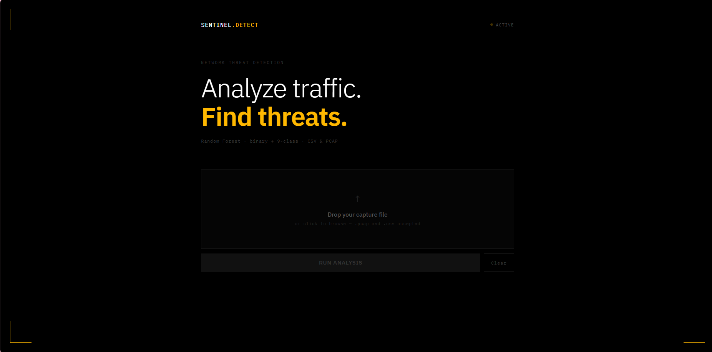
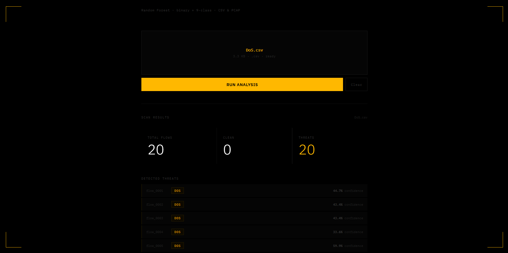

# 🛡️ AI Network Threat Detector

> Analyze network traffic. Detect threats. Classify attacks in real time.

A full-stack AI-powered **Intrusion Detection System (IDS)** built on the UNSW-NB15 dataset. Upload a `.csv` or `.pcap` file and get instant threat analysis: binary classification (normal vs. attack) and multi-class attack type identification across 9 threat categories.



---

## ✨ Features

- 🔍 **Binary Classification** : Detects whether network traffic is normal or malicious
- 🧬 **Multi-Class Classification** : Identifies the attack type across 9 categories
- 📁 **Dual Input Support** : Accepts both `.csv` and `.pcap` file formats
- 🦈 **TShark + NFStream** : `.pcap` files are processed via TShark and NFStream to extract network flow features
- 📊 **Confidence Scores** : Each detected threat comes with a model confidence percentage
- ⚡ **FastAPI Backend** : Runs on WSL/Debian with a Python virtual environment
- 🖥️ **Sentinel UI** : Dark tactical interface built with React

---

## 🧠 Models

| Model | Task | Accuracy | F1 (weighted) |
|-------|------|----------|----------------|
| Random Forest (Binary) | Normal vs. Attack | 90% | 0.90 |
| Random Forest (Multi-class) | Attack Type (9 classes) | 76% | 0.77 |

> **Note on multi-class performance:** The dataset is heavily imbalanced Generic has 40,000 samples while Worms has only 130. SMOTE was applied during training to handle class imbalance.

### Attack Categories Detected
`DoS` `Exploits` `Fuzzers` `Generic` `Reconnaissance` `Backdoor` `Analysis` `Shellcode` `Worms`

---

## 🗂️ Dataset

**UNSW-NB15** — University of New South Wales network traffic dataset  
175,341 samples | 9 attack categories | Real network flows

📎 [Kaggle: UNSW-NB15](https://www.kaggle.com/datasets/mrwellsdavid/unsw-nb15)

---

## 🏗️ Architecture

```
ai-network-threat-detector/
├── backend/
│   ├── main.py                  # FastAPI app (POST /analyze/csv, POST /analyze/pcap)
│   ├── requirement.txt
│   └── models/                  # ⚠️ Not included see Models note below
│       ├── model1_binary.pkl
│       ├── model2_multiclass.pkl
│       ├── encoders.pkl
│       ├── le_attack.pkl
│       └── scaler.pkl
├── frontend/
│   └── src/
│       ├── App.js
│       └── index.js
└── screenshots/
```

> ⚠️ **Model files** are not included in this repo due to size. Download them here: [HuggingFace / Google Drive  link coming soon]

---

## 🔬 How It Works

1. Upload a `.csv` or `.pcap` network capture file
2. If `.pcap`: TShark extracts raw packets → NFStream converts them into network flow features
3. The backend preprocesses and scales the features
4. **Model 1** runs binary classification is this traffic malicious?
5. **Model 2** classifies the attack type for all flagged flows
6. Results display with threat labels and confidence scores

---

## 🚀 Getting Started

### Prerequisites
- Python 3.10+
- Node.js 18+
- WSL / Debian
- TShark (`sudo apt install tshark`)
- NFStream (`pip install nfstream`)

### Backend (run inside WSL/Debian)

```bash
cd backend
python -m venv mlenv
source mlenv/bin/activate
pip install -r requirement.txt
uvicorn main:app --reload --host 0.0.0.0 --port 8000
```

### Frontend

```bash
cd frontend
npm install
npm start
```

Then open `http://localhost:3000`

---

## 🌐 API Endpoints

| Method | Endpoint | Description |
|--------|----------|-------------|
| POST | `/analyze/csv` | Analyze a `.csv` network capture file |
| POST | `/analyze/pcap` | Analyze a `.pcap` network capture file |

---

## 📸 Screenshots

| Upload & Analyze | Threat Results |
|-----------------|----------------|
|  |  |

---

## 🛠️ Tech Stack

| Layer | Technology |
|-------|-----------|
| Frontend | React |
| Backend | FastAPI (Python) |
| Environment | WSL / Debian |
| ML Models | Scikit-learn (Random Forest) |
| PCAP Processing | TShark + NFStream |
| Dataset | UNSW-NB15 (Kaggle) |
| Imbalance Handling | SMOTE (imbalanced-learn) |

---

## 👤 Author

**Sakni Tasnim**  
Telecommunications & Computer Engineering Student  
🔗 [GitHub](https://github.com/Sakni-Tasnim) • [LinkedIn](https://www.linkedin.com/in/sakni-tasnim-0bb856389)

---

## 📄 License

Feel free to use, modify, and build on this project.
